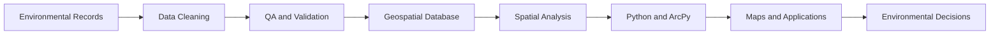

<div align="center">

# 🌎 Oliver Faase

### Environmental GIS • Geospatial Automation • Drone Mapping • Spatial Storytelling

I transform complex environmental information into reproducible GIS workflows,  
interactive applications, and decision-ready visualizations.

<br>

[](mailto:faaseoliver@gmail.com)
[](https://www.linkedin.com/in/oliverfaase/)

</div>

---

## 🌿 About Me

I am an **Environmental GIS Intern** specializing in environmental data management, ArcGIS automation, subsurface visualization, drone imagery, interactive web mapping, and public-facing GIS communication.

My work focuses on creating geospatial systems that are:

- **Traceable**, with clear connections to original records and source documents
- **Reproducible**, through Python, ArcPy, and documented GIS workflows
- **Spatially accurate**, with validated coordinate systems and QA/QC procedures
- **Accessible**, through maps, imagery, applications, and multimedia
- **Decision-ready**, for environmental monitoring, review, and site management

### Areas of Interest

- Environmental and coastal GIS
- Python and ArcPy automation
- Subsurface data visualization
- Drone-based environmental monitoring
- GeoAI-assisted image analysis
- Interactive web mapping and GIS storytelling
- Spatial database development and QA/QC

---

## 📍 Portfolio at a Glance

<div align="center">

<table>
  <tr>
    <td align="center" width="33%"><h3>336+</h3><strong>Investigation Locations</strong><br><sub>Environmental GIS inventory</sub></td>
    <td align="center" width="33%"><h3>5</h3><strong>Automated Cross Sections</strong><br><sub>Python and ArcPy workflow</sub></td>
    <td align="center" width="33%"><h3>2D + 3D + Temporal</h3><strong>GIS Visualization</strong><br><sub>Environmental communication</sub></td>
  </tr>
  <tr>
    <td align="center"><h3>🚁</h3><strong>Drone Monitoring</strong><br><sub>Repeatable aerial imagery</sub></td>
    <td align="center"><h3>🌊</h3><strong>Coastal GIS</strong><br><sub>Shoreline and bathymetry</sub></td>
    <td align="center"><h3>🗺️</h3><strong>Interactive GIS</strong><br><sub>StoryMaps and applications</sub></td>
  </tr>
</table>

</div>

---

# 🗺️ Featured Projects

## 01 | Tacoma Tideflats Closed Landfill GIS and Cross-Section Automation

> **Environmental database development, subsurface modeling, QA/QC, and ArcPy automation**

<div align="center">


</div>

### Project Overview

I developed an integrated GIS database and automated mapping workflow for historical environmental information associated with the former Tacoma Tideflats closed landfill.

The completed inventory includes **336 investigation locations**, including boreholes, monitoring wells, test pits, probes, and soil borings. Records from environmental investigations, parcel reports, historical inspections, methane monitoring, and cleanup-site resources were consolidated into a structured and traceable geospatial framework.

### Project Contributions

- Standardized investigation identifiers and investigation types
- Cleaned contaminant descriptions and analytical-result categories
- Standardized depth measurements and sampling intervals
- Connected investigation locations to available sampling-depth records
- Preserved source-document references and data-match confidence
- Used composite identifiers to reduce incorrect joins
- Distinguished exceedances, detections, landfill material, and missing data
- Prevented missing analytical information from being interpreted as clean
- Avoided extending a single-depth result through an entire boring

### Automated Cross-Section Workflow

The Python and ArcPy automation:

1. Processes cross-section lines
2. Selects nearby investigation locations
3. Calculates each location's station along the section
4. Interprets and validates sampling-depth intervals
5. Generates maps for sections **XS_A through XS_E**
6. Creates ground-surface lines and investigation points
7. Creates depth sticks and analytical interval bands
8. Generates label anchors, grids, axes, and annotations
9. Applies configurable vertical exaggeration
10. Automates feature-class creation and symbology

<details>
<summary><strong>View technical and QA/QC details</strong></summary>

<br>

- Flexible field-name matching
- Null-safe depth parsing
- Duplicate-record handling
- Composite investigation identifiers
- Spatial-reference validation
- Configurable selection distances
- Configurable vertical exaggeration
- Automated feature-class creation and symbology
- Source-document traceability
- Match-confidence fields
- Detailed error and status messages

I also developed a depth-based concentric-buffer workflow that generates polygon rings at three-foot increments. The framework can incorporate additional measurements, including methane readings, as value-based depth-interval overlays.

</details>

### Portfolio Materials

> The project preview, PDF case study, and sanitized ArcGIS Pro package will be added after they are prepared and approved for portfolio use.

### Project Value

This project demonstrates my ability to transform fragmented historical and environmental records into a documented and reproducible GIS workflow. It combines environmental data management, spatial analysis, ArcPy automation, subsurface modeling, QA/QC, and technical communication.

**Skills and technologies:** ArcGIS Pro, Python, ArcPy, environmental GIS, database development, subsurface modeling, cross-section stationing, geoprocessing, QA/QC, 3D visualization, and technical communication.

---

## 02 | Interactive Habitat Assessment StoryMap

> **Habitat mapping, drone imagery, restoration documentation, and environmental storytelling**

<div align="center">


</div>

### Project Overview

I developed an interactive ArcGIS StoryMap showcasing habitat assessment and restoration sites throughout the Port of Tacoma.

The StoryMap combines interactive GIS mapping, high-resolution drone imagery, site descriptions, and aerial flyover videos. Visitors can navigate between habitat locations and explore environmental conditions, restoration work, and the environmental significance of individual sites.

### Project Contributions

- Developed an interactive habitat-site map tour
- Organized site-specific environmental information
- Integrated high-resolution drone imagery
- Helped collect aerial imagery during field operations
- Incorporated drone flyover videos for selected locations
- Created an accessible public-facing GIS experience
- Translated technical environmental information into a visual narrative
- Designed content for staff, stakeholders, and public audiences

### Project Video

https://github.com/user-attachments/assets/10c80feb-7134-409c-aa90-2a8086c44c49

<div align="center">

<br>

[](https://storymaps.arcgis.com/stories/d689d97a246a4b07b0ca6b90a1dcd5a0)

<br><br>

<sub>Select the button to open the public ArcGIS StoryMap.</sub>

</div>

<details>
<summary><strong>View the environmental communication workflow</strong></summary>

<br>

```text
Habitat Assessment Locations
             ↓
Site-Specific Environmental Information
             ↓
Drone Imagery and Flyover Video
             ↓
Interactive Map Tour
             ↓
Environmental Storytelling
             ↓
Public and Stakeholder Communication
```

</details>

### Project Value

By combining geospatial data, aerial imagery, and multimedia content, the StoryMap transforms technical environmental information into an intuitive and engaging experience. The project demonstrates how GIS storytelling and drone technology can improve environmental communication and understanding of habitat conditions and restoration activities.

**Skills and technologies:** ArcGIS StoryMaps, ArcGIS Online, drone imagery, habitat assessment, environmental GIS, interactive web mapping, multimedia integration, site documentation, and public-facing GIS communication.

---

## 03 | Shoreline OIC 2026 Experience Builder

> **Repeatable drone monitoring, oriented imagery, temporal comparison, and shoreline change assessment**

<div align="center">


</div>

### Project Overview

I developed an ArcGIS Experience Builder application supporting long-term shoreline monitoring throughout the Port of Tacoma.

The application displays shoreline monitoring locations as interactive map points and provides an organized way to review environmental conditions across multiple sites and monitoring periods.

### Project Contributions

- Developed an interactive shoreline-monitoring application
- Organized monitoring locations within a centralized GIS platform
- Integrated repeatable drone imagery from predefined flight locations
- Supported comparison of shoreline conditions across monitoring periods
- Structured imagery for consistent year-over-year visual analysis
- Incorporated GeoAI-assisted image-comparison workflows
- Designed the application for environmental review and site documentation
- Improved access to shoreline imagery and monitoring information

### Project Media

<div align="center">


<p><em>Portfolio preview of the Shoreline OIC 2026 Experience Builder application.</em></p>

</div>

### Repeatable Monitoring Approach

Predefined drone flight locations and automated flight plans allow photographs to be captured from consistent positions and viewing angles. This supports comparison of vegetation change, sediment deposition, shoreline erosion, bank stability, habitat shifts, and other visible environmental changes.

### GeoAI-Assisted Analysis

The project incorporates GeoAI-assisted workflows that compare imagery from different monitoring periods and help identify potential shoreline changes. Automated comparison directs attention toward locations that may require closer environmental review.

<details>
<summary><strong>View the shoreline-monitoring workflow</strong></summary>

<br>

```text
Predefined Drone Flight Locations
                ↓
Repeatable Aerial Surveys
                ↓
Time-Stamped Shoreline Imagery
                ↓
Oriented Imagery Organization
                ↓
Experience Builder Visualization
                ↓
Temporal Image Comparison
                ↓
GeoAI-Assisted Change Identification
                ↓
Environmental Review and Documentation
```

</details>

### Project Value

The application provides a centralized platform for organizing drone imagery, visualizing shoreline conditions, comparing monitoring periods, and supporting long-term environmental management.

> **Sharing note:** The live application and its underlying environmental data are not linked. The approved media and description demonstrate the workflow without sharing restricted content.

**Skills and technologies:** ArcGIS Experience Builder, ArcGIS Online, oriented imagery, drone imagery, temporal comparison, shoreline monitoring, environmental GIS, GeoAI-assisted image comparison, and interactive web application development.

---

## 04 | Port of Tacoma Bathymetric Surface Development

> **Hydrographic data processing, TIN-to-raster conversion, terrain modeling, and coastal GIS**

<div align="center">


</div>

### Project Overview

I contributed to the development of a high-resolution bathymetric GIS dataset for the Port of Tacoma by transforming hydrographic survey information into an accurate representation of underwater terrain and seafloor topography.

I processed and converted Triangulated Irregular Network surfaces into raster datasets, making the survey information easier to analyze, visualize, and integrate with other geospatial resources. I also developed raster surfaces constrained to complex, curved shoreline and waterway boundaries to preserve spatial precision.

### Project Contributions

- Processed hydrographic survey information
- Converted TIN surfaces into raster datasets
- Developed rasters constrained to complex shoreline boundaries
- Maintained spatial precision around curved waterways
- Conducted terrain-modeling and spatial-processing operations
- Evaluated outputs for gaps and boundary inconsistencies
- Performed geodatabase management and quality assurance
- Prepared bathymetric layers for analysis and visualization

### Project Media

<div align="center">

<table>
  <tr>
    <td width="50%" valign="top"></td>
    <td width="50%" valign="top"></td>
  </tr>
</table>

<p><em>Bathymetric mapping products developed from hydrographic survey data.</em></p>

</div>

### Project Applications

- Maritime infrastructure planning
- Dredging operations
- Navigational assessments
- Underwater-terrain visualization
- Environmental monitoring
- Coastal and waterway management
- Long-term port planning

<details>
<summary><strong>View the bathymetric surface-development workflow</strong></summary>

<br>

```text
Hydrographic Survey Data
             ↓
Data Review and Preparation
             ↓
Triangulated Irregular Network
             ↓
TIN-to-Raster Conversion
             ↓
Shoreline Boundary Constraints
             ↓
Surface QA/QC
             ↓
Bathymetric Visualization
             ↓
Coastal and Maritime Analysis
```

</details>

### Project Value

The project transformed complex hydrographic measurements into accessible geospatial surfaces that can be used alongside infrastructure, environmental, and operational datasets. Constraining raster surfaces to shoreline and waterway boundaries created a more realistic representation of submerged terrain.

**Skills and technologies:** ArcGIS Pro, bathymetric mapping, hydrographic survey processing, TIN-to-raster conversion, raster surface development, spatial analysis, terrain modeling, geodatabase management, coastal GIS, and QA/QC.

---

## 05 | Cal Poly City and Regional Planning GIS Database and StoryMap

> **Geocoding, spatial database design, interactive planning history, and stakeholder communication**

<div align="center">


</div>

### Project Overview

I created a GIS database and interactive StoryMap to organize, map, and showcase past Cal Poly City and Regional Planning studio projects.

I compiled historical studio-project records, cleaned and standardized the attribute data, and geocoded each project for display in an interactive web map. The resulting database transformed a list of past studio work into a spatial and searchable resource demonstrating the geographic reach and impact of the program.

### Project Contributions

- Compiled historical planning-studio project records
- Cleaned and standardized project attributes
- Geocoded projects by location
- Designed a structured and searchable GIS database
- Categorized projects by topic, year, program level, and instructor
- Developed an interactive ArcGIS StoryMap
- Created a featured planning-studio narrative
- Presented the project to university and alumni stakeholders
- Demonstrated recruitment, outreach, and fundraising applications

### Project Media

<div align="center">


<br><br>

[](https://storymaps.arcgis.com/stories/e9f5d7deea894d049f6b7b41eb5e7232)

<br><br>

<sub>Select the button to open the public ArcGIS StoryMap.</sub>

</div>

### Searchable Project Categories

- Location
- Year
- Program level
- Project type
- Instructor
- Housing
- Transportation
- Climate change
- Policy planning
- Urban design

### Interactive Storytelling

The StoryMap includes an interactive project map and a featured studio example covering:

1. Site analysis and GIS
2. Community outreach and engagement
3. Design development
4. Public presentations
5. Final project deliverables

### Stakeholder Communication

I presented the database and StoryMap to faculty, my department head, university leadership, and an alumni group. The presentations demonstrated how the project could support student recruitment, program outreach, alumni engagement, community partnerships, fundraising, and communication of student-project impact.

<details>
<summary><strong>View the GIS database and StoryMap workflow</strong></summary>

<br>

```text
Historical Studio Records
             ↓
Attribute Cleaning
             ↓
Project Categorization
             ↓
Location Geocoding
             ↓
Spatial Database Development
             ↓
Interactive Web Map
             ↓
ArcGIS StoryMap
             ↓
Recruitment and Public Outreach
```

</details>

### Project Value

The project makes planning-studio work easier to explore by connecting each project to its location, year, topic, instructor, program level, and planning focus. It gives prospective students, alumni, donors, faculty, and community partners an accessible way to understand the program's geographic reach and real-world impact.

**Skills and technologies:** Geocoding, ArcGIS Online, ArcGIS StoryMaps, GIS data cleaning, spatial database design, interactive web mapping, project categorization, urban planning, public presentation, and stakeholder communication.

---

# 🛠️ Technical Toolkit

<div align="center">


<br>


<br>


</div>

---

# 🔄 Project Approach



### Core Principles

- Preserve traceability to original records
- Document assumptions and limitations
- Distinguish missing information from confirmed absence
- Automate repeatable processes where appropriate
- Validate spatial references and data structures
- Design outputs for technical and nontechnical audiences
- Communicate environmental information accurately and responsibly

---

# 📫 Connect With Me

I am interested in environmental GIS, geospatial automation, spatial data science, shoreline monitoring, drone-based mapping, coastal planning, and tools that make environmental information easier to understand.

<div align="center">

[](mailto:faaseoliver@gmail.com)
[](https://www.linkedin.com/in/oliverfaase/)

<br><br>

### 🌎 Environmental GIS • 🗺️ Automation • 🌿 Visualization • 🌊 Communication

</div>
